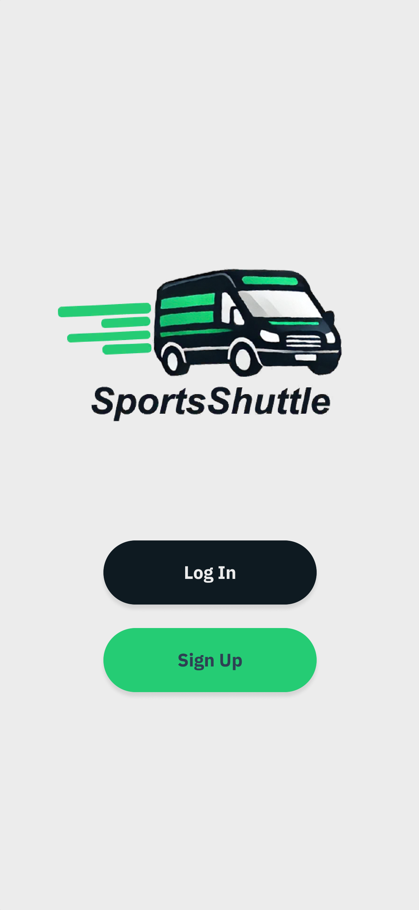
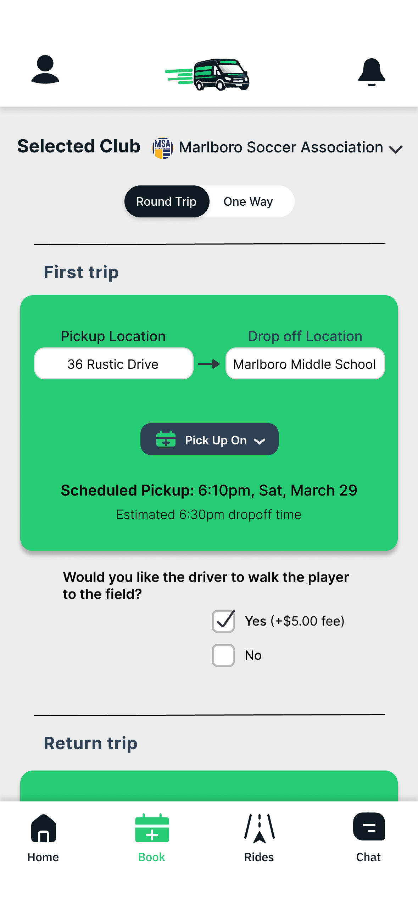
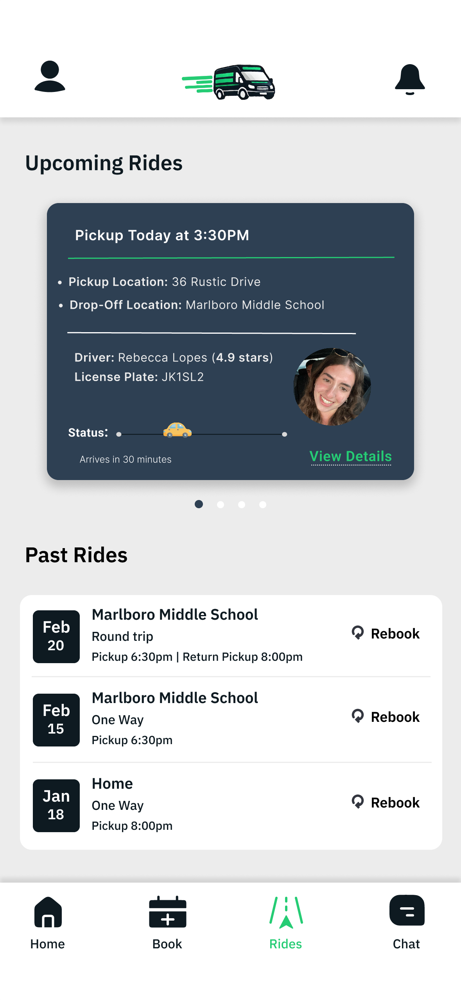
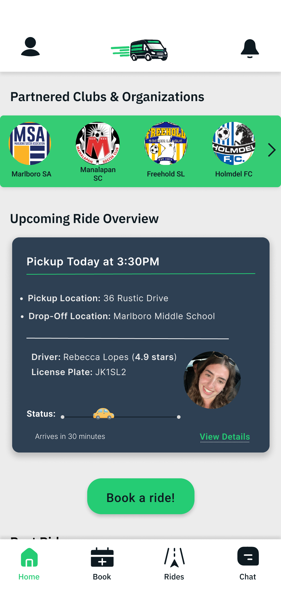
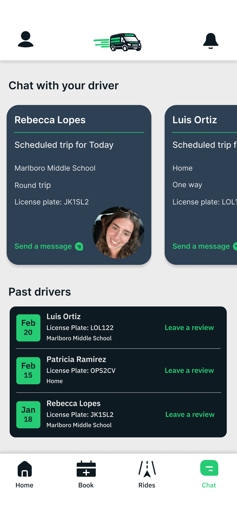

# SportsShuttle – Driver App  

A mobile transportation platform for youth sports clubs that connects trusted drivers with parents and players.  
Designed and prototyped in **Figma** using **UI/UX principles** (minimalist layouts + accessibility-focused design).  
The Driver App streamlines ride management by enabling drivers to view booking requests, manage active rides, and communicate with families. 

---

## Screens  

  
  

  
  

  

---

## Features  
- View and accept ride requests  
- Manage active rides with status updates  
- Communicate with families through messaging  
- Partnered club integration for trusted drivers  

---

