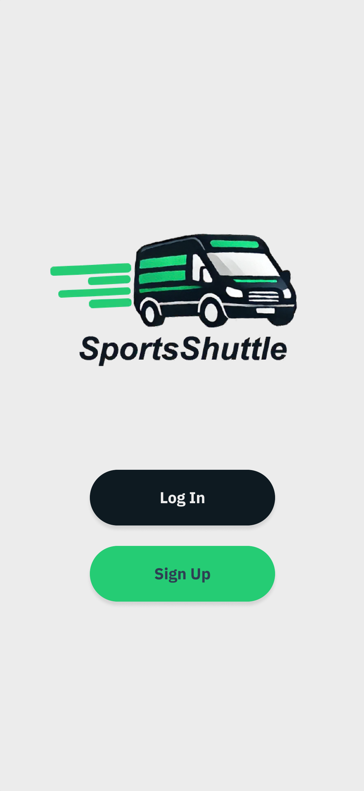
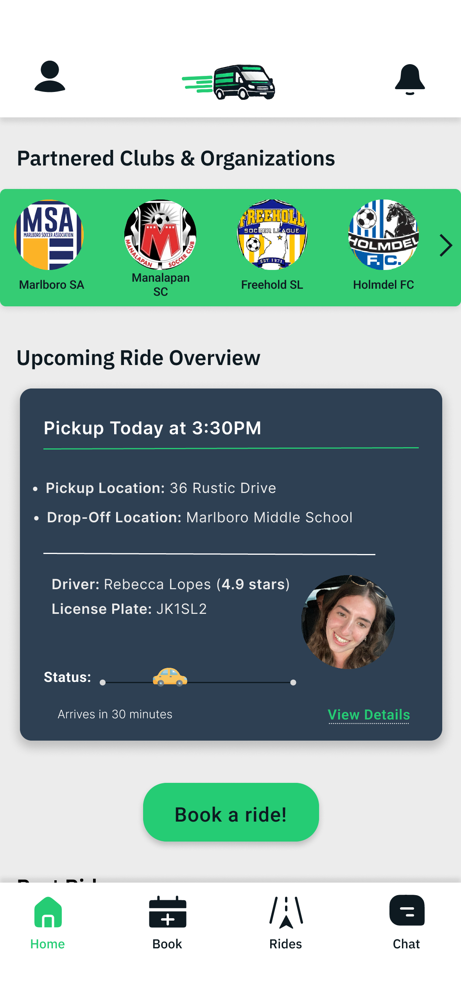
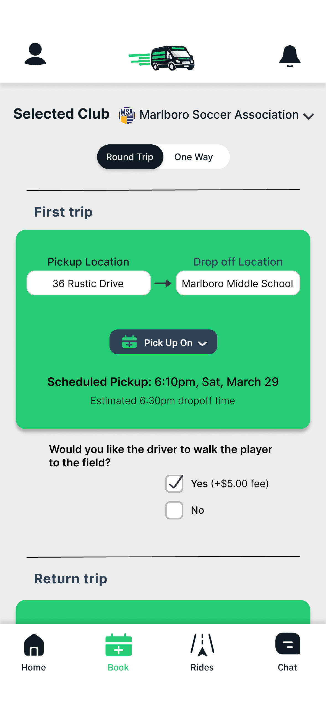
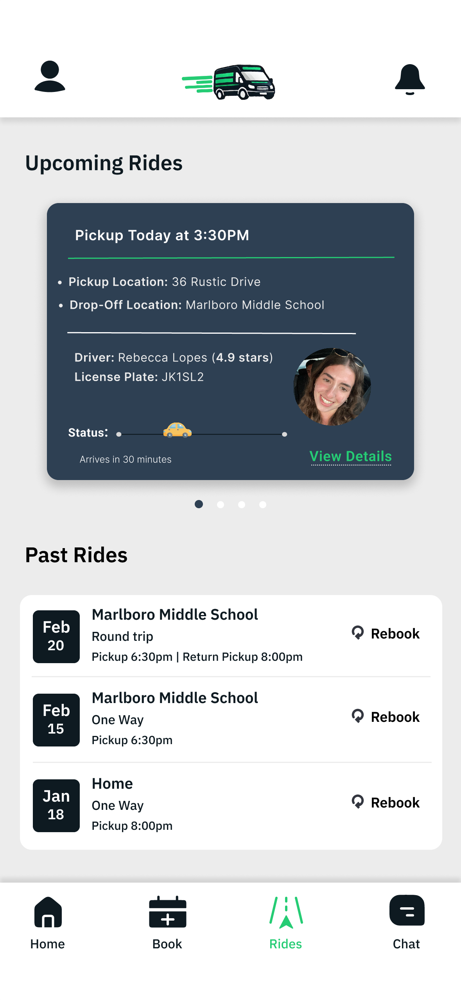
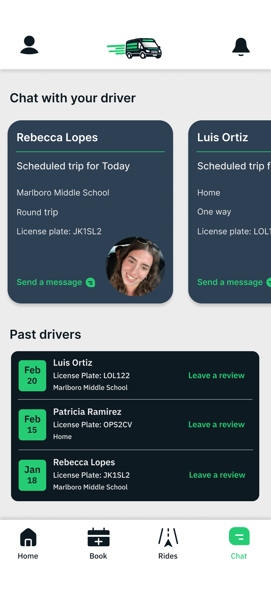

# SportsShuttle – Pasenger App  

A mobile transportation platform for parents to securely connect with trusted drivers from youth sports clubs, helping their kids get to practices and games safely. Designed and prototyped in **Figma** using **UI/UX principles** (minimalist layouts + accessibility-focused design).  
The Driver App streamlines ride management by enabling drivers to view booking requests, manage active rides, and communicate with families. 

---

## Screens  

  
  

  
  

  

---

## Features  
- View and accept ride requests  
- Manage active rides with status updates  
- Communicate with families through messaging  
- Partnered club integration for trusted drivers  

---
## Design Prototype  
View the full Figma wireframes here:  
https://www.figma.com/design/BDUaVwFOsSLK3G4tdGkugs/Sports?node-id=1-2&t=a85yM6oiClIxwm1X-1
